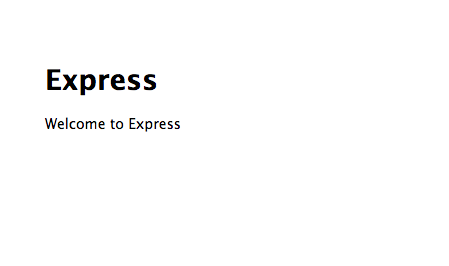

Acronym Explanation:
--------------------

* M - Mongo.db is a no-sql database (really scalable)
* E - Express.js a framework for node.js (node.js is not a framework)
* A - Angular.js a quick way of creating webapps
* N - Node.js server-side javascript

The hope of this (and perhaps some Jade Templating) is to minimize the time and lines-of-code necessary for a site set-up and to maximize the maintability of a site.

**a side-goal is to get Node.js, which is actively developed and adds great future potential to a site


## Installing the Mean stack:


This gets you the latest version of Node.js
```bash
sudo apt-get update
sudo apt-get install -y python-software-properties python g++ make
sudo add-apt-repository -y ppa:chris-lea/node.js
sudo apt-get update
sudo apt-get install nodejs
```

This gets you express.js
```bash
npm install -g express
```

### Success!



## References:

These notes are compiled mainly from the following sources:

* http://cwbuecheler.com/web/tutorials/2013/node-express-mongo/?src=hn
* 
